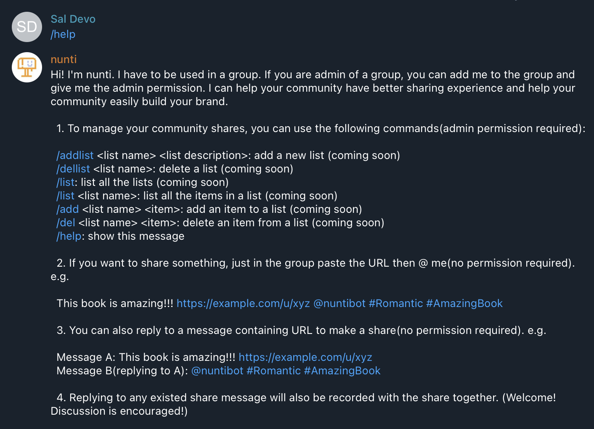

# Nunti

Nunti is a Telegram bot developed as part of the [coLib](https://colib.app) project. Nunti can help aggregate and parse the share message in both telegram channel and group.

You can find nunti at [@nuntibot](https://t.me/nuntibot).



## Usage

### Prerequisite

**Telegram Bot**
To run the bot locally, you need to create a bot firstly by yourself.

1. Create a new Telegram bot by following the instructions [here](https://core.telegram.org/bots#3-how-do-i-create-a-bot).
2. Obtain the bot token.
3. Rename the `.env.example` file to `.env` and update the `BOT_TOKEN` value with your bot token.

** Admin Account **
To run the bot locally, you need to create an admin account with sufficient $CSB as well.
1. Create a new account in Metamask or any other wallet you will use.
2. Get $CSB from [faucet](https://faucet.crossbell.io/)
3. Obtain the private key of your admin account.
3. Rename the `.env.example` file to `.env` and update the `APP_ADMIN` value with your private key. Please be sure to make it start with "0x".

** OpenAI API Key(Optional) **
Nunti offers the option to use Elephant SDK as the URL parser, which is based on OpenAI API Key. This is optional and you can also leave it empty, so that Nunti will use other parser as fallback.
1. Create an account at openai[https://openai.com/].
2. Rename the `.env.example` file to `.env` and update the `OPENAI_MODEL` and `OPENAI_API_KEY` with your selected model and key.

### Development
```
# For the first time to run the app, you need to manually create the `./store` folder
mkdir -p store

# Develop
pnpm dev 

# Build
pnpm build

# Start 
pnpm start
```

## Contributing

Contributions are welcome! If you have any ideas, suggestions, or bug reports, please open an issue or submit a pull request.

## License

This project is licensed under the GNU Lesser General Public License (LGPL) version 3.0. You can find the full text of the license [here](https://www.gnu.org/licenses/lgpl-3.0.en.html).
